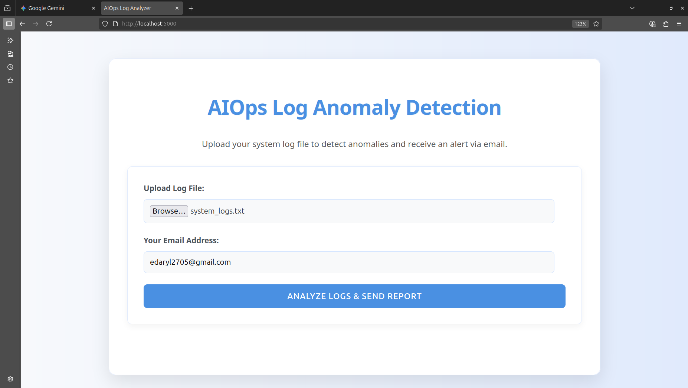
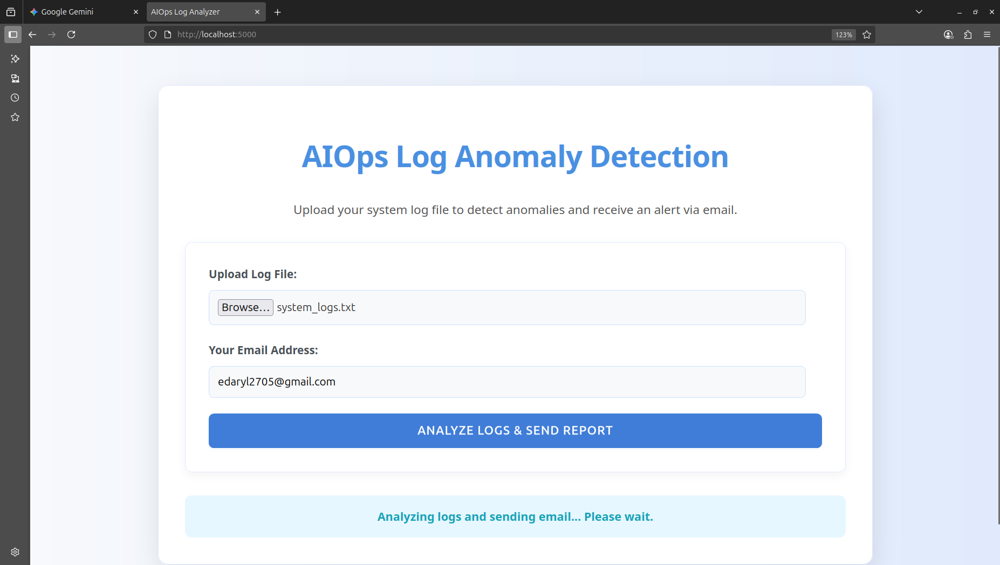
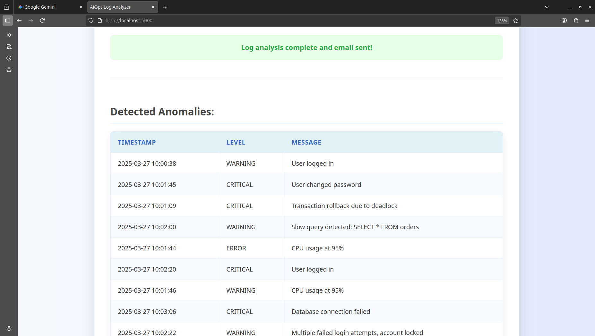
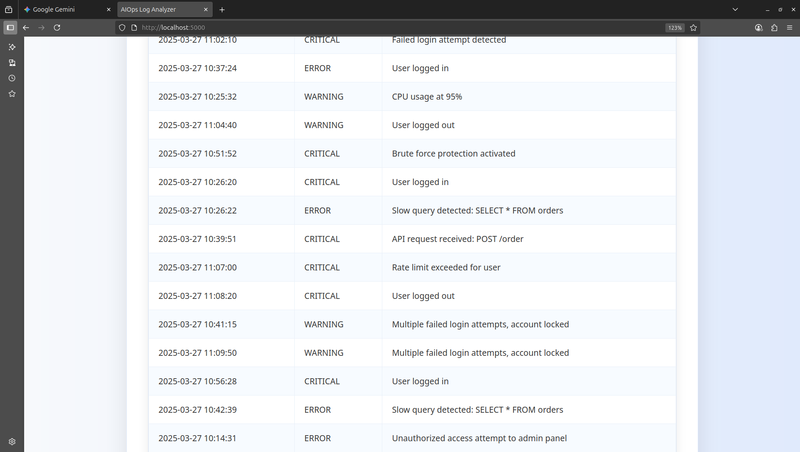

# AIOps-log-analysis

## 🚀 Project Overview

This project is a simple yet effective web application designed to demonstrate the core principles of AIOps (Artificial Intelligence for IT Operations) by automating the detection of anomalies in system log files. Users can upload their log files, and the application will process them using a machine learning model to identify unusual patterns, providing a quick way to pinpoint potential issues in their system's behavior.

The application serves as a foundational example of how AI/ML can be integrated into operational workflows to enhance monitoring, reduce manual effort, and enable proactive problem-solving.

## 🤖 AIOps Focus

At its heart, this application embodies the "Observe" and "Engage" pillars of AIOps:

Automated Anomaly Detection: Instead of manually sifting through vast amounts of log data, the application leverages the IsolationForest algorithm to automatically identify deviations from normal behavior. This significantly reduces the time and effort required for log analysis.

Proactive Alerting: Upon detecting anomalies, the system automatically sends an email alert to the specified user. This shifts the operational paradigm from reactive (responding after a failure occurs) to proactive (being notified of potential issues before they escalate).

Data-Driven Insights: By analyzing log levels and message lengths, the model learns what constitutes "normal" log behavior and flags what's "abnormal," providing data-driven insights that might be missed by simple keyword searches or threshold alerts.

Simplified Operational Workflow: The web interface makes it easy for IT operators, developers, or anyone managing a system to quickly analyze logs without needing deep knowledge of machine learning or command-line tools.

## ✨ Features

Log File Upload: Users can easily upload .txt or .log files through a user-friendly web interface.

AI-Powered Anomaly Detection: Utilizes the Isolation Forest algorithm to identify unusual log entries.

Real-time UI Feedback: Displays analysis status and results directly on the webpage.

Conditional Anomaly Display: Clearly indicates whether anomalies were detected or not, along with a table view of any identified anomalies.

Email Notifications: Sends an automated email alert to the user if anomalies are detected (or a confirmation if none are found), prompting them to review the detailed report on the web application.

Responsive Design: The web interface is designed to be usable across various devices (desktop, tablet, mobile).

## 🛠️ Technologies Used

Frontend:

HTML5: Structure of the web page.

CSS3: Styling and visual presentation (modern, clean design).

JavaScript (ES6+): Handles file uploads, asynchronous communication with the backend, and dynamic UI updates.

Font Awesome: For alert and success icons.

Backend:

Python 3: Core logic for log analysis and email sending.

Flask: A lightweight Python web framework for handling HTTP requests (file uploads, API endpoints).

Pandas: For efficient data manipulation and analysis of log entries.

NumPy: Numerical computing support for Pandas and Scikit-learn.

Scikit-learn: Provides the IsolationForest machine learning model for anomaly detection.

smtplib & email.mime: Python's built-in libraries for sending emails.

## ⚙️ Setup and Installation

Follow these steps to get the project up and running on your local machine.

### 1. Clone the Repository (or create files manually)

        https://github.com/DarylAdrien/AIOps-log-analysis.git

### 2. Python Environment Setup

It's highly recommended to use a virtual environment to manage dependencies.

#### Create a virtual environment

        python -m venv venv

#### Activate the virtual environment

#### On Windows:

        .\venv\Scripts\activate

#### On macOS/Linux:
        
        source venv/bin/activate

### 3. Install Dependencies

With your virtual environment activated, install the required Python packages:

        pip install Flask pandas numpy scikit-learn

### 4. Configure Email Sending

Open app.py and locate the EMAIL_USER and EMAIL_PASSWORD variables. You MUST replace these placeholders with your actual email credentials.

#### app.py

EMAIL_USER = "your_email@example.com"      # <--- REPLACE THIS
EMAIL_PASSWORD = "your_email_app_password" # <--- REPLACE THIS (Use an App Password for Gmail)
SMTP_SERVER = "smtp.gmail.com"
SMTP_PORT = 587

Important Notes for Gmail Users:

2-Step Verification (2FA) is Required: You must have 2-Step Verification enabled on your Google Account to generate App Passwords.

Generate an App Password: Go to your Google Account -> Security -> 2-Step Verification -> App passwords. Generate a new 16-character password and use that in EMAIL_PASSWORD. Do NOT use your main Google account password directly.

For production environments, consider using dedicated email services like SendGrid, Mailgun, or AWS SES for better reliability and scalability.

### 5. Place Log Analysis Script

Ensure your aiops_log_analysis.py file (the corrected version with contamination=0.0001) is in the same directory as app.py.

### 6. Run the Flask Application

Navigate to your project's root directory in your terminal (where app.py is located) and run:

python app.py

You should see output indicating that the Flask development server is running, typically on http://127.0.0.1:5000.
🚀 Usage

Open your browser and navigate to the address provided by Flask (e.g., http://127.0.0.1:5000).

Upload Log File: Click "Choose File" and select a .txt or .log file from your system.

Enter Email Address: Provide the email address where you want to receive anomaly alerts.

Analyze & Send Report: Click the "Analyze Logs & Send Report" button.

Review Results:

A status message will appear at the top, indicating the analysis progress and email sending status.

If anomalies are detected, a prominent "Anomaly Detected! 🚨" message will appear, followed by a table listing the anomalous log entries.

If no anomalies are detected, a "No Anomalies Detected! ✅" message will be displayed.

An email alert will be sent to the provided email address, notifying you of the analysis outcome.

## 📈 Future Enhancements

More Sophisticated Anomaly Models: Explore other unsupervised learning algorithms (e.g., One-Class SVM, autoencoders) or time-series specific anomaly detection methods.

Log Parsing Improvements: Use more robust log parsing libraries (e.g., loguru, regex) to handle diverse log formats.

Threshold Customization: Allow users to adjust anomaly detection parameters (e.g., contamination in Isolation Forest) via the UI.

Historical Data Analysis: Implement storage (e.g., a simple database) to analyze trends and anomalies over time.

Dashboarding: Integrate with visualization libraries (e.g., D3.js, Chart.js) to create interactive dashboards for log metrics and anomaly trends.

Advanced Alerting: Integrate with other notification channels like Slack, PagerDuty, or SMS.

Authentication: Add user authentication for multi-user environments.

    Dockerization: Containerize the application for easier deployment.
